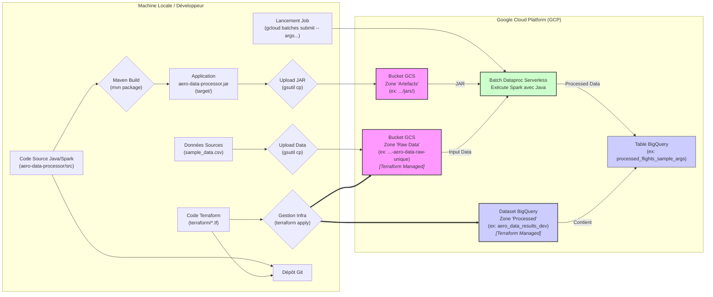

# Projet : Pipeline de Données GCP Java/Spark (Simulation Maintenance Aéronautique)

## 1. Introduction et Objectif

Ce projet met en œuvre un pipeline de données Big Data sur Google Cloud Platform (GCP) en utilisant Java et Apache Spark. Son objectif principal est de simuler un cas d'usage pertinent pour l'optimisation de la maintenance dans le secteur aéronautique, inspiré par une offre de mission pour un rôle de Data Engineer / Tech Lead.

Il sert également de démonstration pratique des compétences en traitement de données distribuées, gestion d'infrastructure cloud et bonnes pratiques de développement.

Enfin, ce projet est conçu comme une **simulation de migration** vers le cloud, représentant l'état cible d'une architecture de données moderne sur GCP, en remplacement d'un système hérité (hypothétique).

## 2. Architecture

Le pipeline suit le flux de données suivant :

1.  **Données Sources :** Des fichiers plats (ex: CSV contenant des informations de vols simulées) sont stockés localement ou proviennent d'un système externe.
2.  **Ingestion (Simulation) :** Les données sources sont uploadées manuellement (via `gsutil`) vers un bucket **Google Cloud Storage (GCS)** servant de zone de stockage brute ("Raw Zone").
3.  **Traitement :** Une application **Java/Spark** (packagée en JAR) est exécutée sur **Dataproc Serverless**.
    * L'application lit les données brutes depuis le bucket GCS "Raw Zone".
    * Elle effectue des transformations et des enrichissements en utilisant l'API Spark SQL / DataFrame.
    * Le JAR de l'application est également stocké sur GCS.
4.  **Stockage des Résultats :** Les données transformées et structurées sont écrites dans une table **BigQuery**, servant de Data Warehouse pour l'analyse.
5.  **Infrastructure :** Les ressources GCP nécessaires (Bucket GCS, Dataset BigQuery) sont définies et gérées via **Terraform** (Infrastructure as Code).
6.  **Configuration :** Les paramètres spécifiques à l'environnement (ID projet, chemins) sont gérés via `terraform.tfvars` pour l'infrastructure et passés en arguments de ligne de commande à l'application Spark.



## 3. Stack Technique

* **Langage :** Java 11
* **Framework Big Data :** Apache Spark 3.4.1 (Core & SQL)
* **Cloud :** Google Cloud Platform (GCP)
    * Stockage : Google Cloud Storage (GCS)
    * Traitement : Dataproc Serverless (pour les "Batches" Spark)
    * Data Warehouse : BigQuery
* **Infrastructure as Code :** Terraform (1.11.3)
* **Build Tool :** Apache Maven
* **Version Control :** Git

## 4. Structure du Projet

Le projet est organisé comme suit :

* `/` : Racine (README.md, .gitignore, sample_data.csv)
* `aero-data-processor/` : Module Maven pour l'application Java/Spark (`pom.xml`, `src/`).
* `terraform/` : Code Terraform pour l'infrastructure GCP (`.tf`, `.tfvars`).

## 5. Prérequis

Pour exécuter ce projet, vous aurez besoin de :

* Git : Pour cloner le dépôt.
* JDK 11 : Pour compiler et exécuter le code Java/Spark localement (si besoin) et requis par Spark 3.4.
* Apache Maven : Pour compiler l'application et gérer les dépendances.
* Google Cloud SDK (`gcloud`) : Pour interagir avec GCP (authentification, soumission de jobs). Doit être configuré et authentifié (exécuter `gcloud auth application-default login`).
* Terraform CLI : Pour déployer l'infrastructure GCP.
* Compte Google Cloud Platform : Avec un projet GCP créé et les API nécessaires activées (Compute Engine, Dataproc, Cloud Storage, BigQuery).

## 6. Configuration

Avant de lancer le pipeline, deux niveaux de configuration sont nécessaires :

1.  **Terraform :**
    * Créez un fichier `terraform/terraform.tfvars` (ce fichier est ignoré par Git).
    * Définissez les variables suivantes dedans :
        ```hcl
        # terraform/terraform.tfvars
        project_id             = "<VOTRE_PROJECT_ID_GCP>"
        region                 = "<VOTRE_REGION_GCP>" # ex: "europe-west1"
        gcs_bucket_name_suffix = "<SUFFIXE_UNIQUE_POUR_BUCKET>" # ex: "aero-data-raw-monprojet"
        bq_dataset_name        = "<NOM_DATASET_BIGQUERY>" # ex: "aero_data_results_dev"
        ```

2.  **Application Spark (Arguments de Ligne de Commande) :**
    * L'application `AeroDataProcessorApp` attend 5 arguments lors de sa soumission via `gcloud`.
    * Ces arguments doivent être passés **après** le double tiret (`--`) dans la commande `gcloud dataproc batches submit spark`.
    * **Ordre des arguments :**
        1.  `GCS_INPUT_PATH` : Chemin complet vers le fichier ou dossier source sur GCS (ex: `gs://<NOM_BUCKET>/raw_data/sample_data.csv`).
        2.  `GCS_TEMP_BUCKET` : Nom du bucket GCS à utiliser pour les fichiers temporaires BigQuery (peut être le même que celui des données).
        3.  `BQ_PROJECT_ID` : ID de votre projet GCP.
        4.  `BQ_DATASET_NAME` : Nom du dataset BigQuery cible (créé par Terraform).
        5.  `BQ_TABLE_NAME` : Nom de la table à créer ou écraser dans BigQuery.

## 7. Comment Lancer le Pipeline (Étape par Étape)

*Toutes les commandes sont à lancer depuis la racine du projet (`gcp-java-spark-migration/`), sauf indication contraire.*

1.  **Cloner le Dépôt :**
    ```bash
    git clone <URL_DU_DEPOT>
    cd gcp-java-spark-migration
    ```
2.  **Configurer Terraform :**
    * Créez et remplissez `terraform/terraform.tfvars` comme indiqué à la section 6.
3.  **Déployer l'Infrastructure GCP :**
    ```bash
    cd terraform
    terraform init
    terraform apply # Confirmer avec 'yes'
    cd ..
    ```
    *Note : Notez le nom exact du bucket GCS créé (affiché par Terraform ou visible dans la console GCP).*
4.  **Uploader les Données Sources sur GCS :**
    ```bash
    # Remplacer <NOM_BUCKET_CREE> par le nom réel du bucket
    gsutil cp sample_data.csv gs://<NOM_BUCKET_CREE>/raw_data/
    ```
5.  **Compiler l'Application Spark JAR :**
    ```bash
    cd aero-data-processor
    mvn clean package
    cd ..
    ```
6.  **Uploader le JAR Applicatif sur GCS :**
    ```bash
    # Remplacer <NOM_BUCKET_CREE>
    gsutil cp aero-data-processor/target/aero-data-processor-1.0-SNAPSHOT.jar gs://<NOM_BUCKET_CREE>/jars/
    ```
7.  **Soumettre le Job Dataproc Serverless :**
    ```bash
    # Remplacer <TA_REGION>, <NOM_BUCKET_CREE>, <TON_PROJECT_ID>
    # et ajuster les noms dataset/table si nécessaire pour correspondre à votre config et aux args attendus
    gcloud dataproc batches submit spark \
        --region=<TA_REGION> \
        --jars=gs://<NOM_BUCKET_CREE>/jars/aero-data-processor-1.0-SNAPSHOT.jar \
        --class=com.remi.aero.AeroDataProcessorApp \
        -- \
        gs://<NOM_BUCKET_CREE>/raw_data/sample_data.csv \
        <NOM_BUCKET_CREE> \
        <TON_PROJECT_ID> \
        aero_data_results_dev \
        processed_flights_sample_args
    ```
8.  **Vérifier les Résultats :**
    * Suivez le statut du job dans la Console GCP > Dataproc > Serverless > Batches.
    * Consultez les logs du driver pour analyser l'exécution.
    * Vérifiez la présence et le contenu de la table (`processed_flights_sample_args`) dans votre dataset BigQuery (`aero_data_results_dev`).

## 8. Aspect "Simulation de Migration"

Ce projet illustre plusieurs facettes d'une migration vers GCP :

* **Définition de l'Infrastructure Cible :** Utilisation de Terraform pour créer de manière reproductible l'environnement d'accueil (GCS, BigQuery) sur GCP.
* **Transfert de Données (Simulé) :** L'upload des données vers GCS représente l'étape où les données de l'ancien système seraient transférées vers le Data Lake sur GCP.
* **Adaptation du Traitement :** Le code Spark/Java est conçu pour s'exécuter dans l'écosystème cloud (Dataproc) et interagir avec les services managés (GCS, BigQuery), remplaçant potentiellement un ancien système de traitement local ou on-premise.

## 9. Améliorations Possibles

* Utiliser des données aéronautiques publiques plus riches et variées.
* Implémenter une logique métier Spark plus complexe (calculs d'usure, jointures, détections d'anomalies...).
* Définir explicitement les schémas de données (lecture CSV, table BigQuery via Terraform).
* Ajouter des tests unitaires pour la logique de transformation Spark.
* Mettre en place une orchestration du pipeline (ex: Cloud Composer).
* Améliorer la gestion des erreurs et la robustesse du parsing d'arguments.
* Configurer un compte de service dédié pour l'exécution Dataproc avec des permissions IAM affinées.
* Ajouter du monitoring et des alertes.