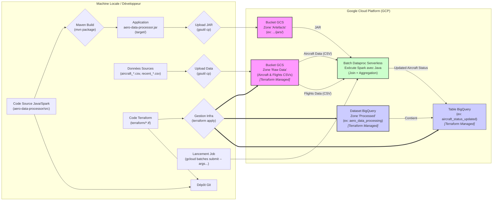

# Projet : Pipeline de Données GCP Java/Spark (Simulation Maintenance Aéronautique)

## 1. Introduction et Objectif

Ce projet met en œuvre un pipeline de données Big Data sur Google Cloud Platform (GCP) en utilisant Java et Apache Spark. Son objectif principal est de simuler un cas d'usage pertinent pour l'optimisation de la maintenance dans le secteur aéronautique : la **mise à jour des heures de vol totales des aéronefs** en fonction des vols récents. Ce projet a été inspiré par une offre de mission pour un rôle de Data Engineer / Tech Lead.

Il sert également de démonstration pratique des compétences en traitement de données distribuées (Spark), gestion d'infrastructure cloud (GCP, Terraform), et bonnes pratiques de développement (Java, Maven, Git, Tests Unitaires de base).

Enfin, ce projet est conçu comme une **simulation de migration** vers le cloud, représentant l'état cible d'une architecture de données moderne sur GCP, en remplacement d'un système hérité (hypothétique).

## 2. Architecture

Le pipeline suit le flux de données suivant :

1.  **Données Sources :** Deux fichiers CSV sont utilisés : l'un représentant l'état initial des avions (`aircraft_initial_state.csv`), l'autre les vols récents (`recent_flights.csv`). Ils sont stockés localement ou proviennent d'un système externe.
2.  **Ingestion (Simulation) :** Les données sources sont uploadées manuellement (via `gsutil`) vers un bucket **Google Cloud Storage (GCS)** servant de zone de stockage brute ("Raw Zone").
3.  **Traitement :** Une application **Java/Spark** (packagée en JAR) est exécutée sur **Dataproc Serverless**.
    * L'application lit les deux fichiers CSV depuis GCS en appliquant des schémas prédéfinis.
    * Elle joint les informations, agrège les heures de vol récentes par avion, et calcule le nouveau total d'heures de vol.
    * Le JAR de l'application est également stocké sur GCS.
4.  **Stockage des Résultats :** L'état mis à jour des avions (avec les nouvelles heures de vol) est écrit dans une table **BigQuery** dédiée, servant de Data Warehouse pour l'analyse.
5.  **Infrastructure :** Les ressources GCP nécessaires (Bucket GCS, Dataset BigQuery, Table BigQuery avec schéma) sont définies et gérées via **Terraform** (Infrastructure as Code).
6.  **Configuration :** Les paramètres spécifiques à l'environnement (ID projet, chemins, noms de table/dataset) sont gérés via `terraform.tfvars` pour l'infrastructure et passés en **arguments de ligne de commande** à l'application Spark.



## 3. Stack Technique

* **Langage :** Java 11
* **Framework Big Data :** Apache Spark 3.4.1 (Core & SQL)
* **Cloud :** Google Cloud Platform (GCP)
    * Stockage : Google Cloud Storage (GCS)
    * Traitement : Dataproc Serverless (pour les "Batches" Spark)
    * Data Warehouse : BigQuery
* **Infrastructure as Code :** Terraform (`1.11.3`)
* **Build Tool :** Apache Maven
* **Tests :** JUnit 5 (Jupiter), AssertJ
* **Version Control :** Git

## 4. Structure du Projet

Le projet est organisé comme suit :

* `/` : Racine (README.md, .gitignore, fichiers CSV exemples)
    * `aircraft_initial_state.csv` : Données initiales exemple.
    * `recent_flights.csv` : Vols récents exemple.
* `aero-data-processor/` : Module Maven pour l'application Java/Spark (`pom.xml`, `src/main/java`, `src/main/resources`, `src/test/java`).
    * `src/main/java/com/remi/aero/AeroDataProcessorApp.java`: Code principal du pipeline.
    * `src/test/java/com/remi/aero/AeroDataProcessorAppTest.java`: Tests unitaires JUnit.
* `terraform/` : Code Terraform pour l'infrastructure GCP (`.tf`, `.tfvars`).

## 5. Prérequis

Pour exécuter ce projet, vous aurez besoin de :

* Git
* JDK 11
* Apache Maven
* Google Cloud SDK (`gcloud`) configuré et authentifié (`gcloud auth application-default login`)
* Terraform CLI (`1.11.3`)
* Compte Google Cloud Platform avec un projet créé et les API nécessaires activées (Compute Engine, Dataproc, Cloud Storage, BigQuery, IAM).

## 6. Configuration

1.  **Terraform :**
    * Créez un fichier `terraform/terraform.tfvars` (ignoré par Git).
    * Définissez les variables suivantes dedans :
        ```hcl
        # terraform/terraform.tfvars
        project_id             = "<VOTRE_PROJECT_ID_GCP>"
        region                 = "<VOTRE_REGION_GCP>" # ex: "europe-west1"
        gcs_bucket_name_suffix = "<SUFFIXE_UNIQUE_POUR_BUCKET>" # ex: "aero-data-proc-monprojet"
        bq_dataset_name        = "<NOM_DATASET_BIGQUERY>" # ex: "aero_data_processing"
        # Note: Le nom de la table de sortie est maintenant géré via les args de l'app Spark,
        # mais la table elle-même ('aircraft_status_updated') est définie dans main.tf.
        ```

2.  **Application Spark (Arguments de Ligne de Commande) :**
    * L'application `AeroDataProcessorApp` attend **6** arguments lors de sa soumission via `gcloud`.
    * Ordre des arguments (passés après `--`) :
        1.  `aircraft_input_path`: Chemin GCS vers `aircraft_initial_state.csv`. (ex: `gs://<NOM_BUCKET>/raw_data/aircraft_initial_state.csv`)
        2.  `flights_input_path`: Chemin GCS vers `recent_flights.csv`. (ex: `gs://<NOM_BUCKET>/raw_data/recent_flights.csv`)
        3.  `gcs_temp_bucket`: Nom du bucket GCS pour les fichiers temporaires BigQuery. (ex: `<NOM_BUCKET>`)
        4.  `bq_project_id`: ID de votre projet GCP. (ex: `<VOTRE_PROJECT_ID_GCP>`)
        5.  `bq_dataset_name`: Nom du dataset BigQuery cible. (ex: `aero_data_processing`)
        6.  `bq_output_table_name`: Nom de la table à créer/écraser dans BigQuery. (ex: `aircraft_status_updated`)

## 7. Comment Lancer le Pipeline (Étape par Étape)

*Toutes les commandes sont à lancer depuis la racine du projet (`gcp-java-spark-migration/`), sauf indication contraire.*

1.  **Cloner le Dépôt :**
    ```bash
    git clone <URL_DU_DEPOT>
    cd gcp-java-spark-migration
    ```
2.  **Configurer Terraform :**
    * Créez et remplissez `terraform/terraform.tfvars`.
3.  **Déployer l'Infrastructure GCP :**
    ```bash
    cd terraform
    terraform init
    terraform apply # Confirmer avec 'yes'. Crée bucket GCS, dataset BQ, et table BQ 'aircraft_status_updated'.
    cd ..
    ```
    *Notez le nom exact du bucket GCS créé.*
4.  **Uploader les Données Sources sur GCS :**
    ```bash
    # Remplacer <NOM_BUCKET_CREE> par le nom réel du bucket
    gsutil cp aircraft_initial_state.csv gs://<NOM_BUCKET_CREE>/raw_data/
    gsutil cp recent_flights.csv gs://<NOM_BUCKET_CREE>/raw_data/
    ```
5.  **Compiler l'Application Spark JAR :**
    ```bash
    cd aero-data-processor
    # Assurez-vous que <scope>provided</scope> EST présent pour les dépendances Spark dans pom.xml
    mvn clean package
    cd ..
    ```
6.  **Uploader le JAR Applicatif sur GCS :**
    ```bash
    # Remplacer <NOM_BUCKET_CREE>
    gsutil cp aero-data-processor/target/aero-data-processor-1.0-SNAPSHOT.jar gs://<NOM_BUCKET_CREE>/jars/
    ```
7.  **Soumettre le Job Dataproc Serverless :**
    ```bash
    # Remplacer TOUS les placeholders <...> par vos valeurs réelles
    gcloud dataproc batches submit spark \
        --region=<TA_REGION> \
        --jars=gs://<NOM_BUCKET_CREE>/jars/aero-data-processor-1.0-SNAPSHOT.jar \
        --class=com.remi.aero.AeroDataProcessorApp \
        -- \
        gs://<NOM_BUCKET_CREE>/raw_data/aircraft_initial_state.csv \
        gs://<NOM_BUCKET_CREE>/raw_data/recent_flights.csv \
        <NOM_BUCKET_CREE> \
        <TON_PROJECT_ID> \
        <NOM_DATASET_BIGQUERY> \
        aircraft_status_updated
    ```
8.  **Vérifier les Résultats :**
    * Suivez le statut du job (`Succeeded`/`Failed`) dans la Console GCP > Dataproc > Serverless > Batches.
    * Consultez les logs du driver.
    * Vérifiez le contenu de la table `aircraft_status_updated` dans votre dataset BigQuery.

## 8. Aspect "Simulation de Migration"

Ce projet illustre plusieurs facettes d'une migration vers GCP :

* **Infrastructure Cible via IaC :** Utilisation de Terraform pour créer l'environnement GCP (GCS, BQ Dataset + Table).
* **Transfert de Données (Simulé) :** Upload des CSV vers GCS.
* **Adaptation du Traitement :** Code Spark/Java conçu pour l'écosystème cloud (Dataproc, connecteurs GCS/BQ), lisant et écrivant sur les services managés.

## 9. Améliorations Possibles

* Utiliser des données aéronautiques publiques plus riches et variées.
* Implémenter une logique métier Spark plus complexe (calculs de cycles de maintenance, jointures avec météo/pannes...).
* **Tests Unitaires :** Étendre la couverture des tests (tester la lecture, l'écriture avec mocks, d'autres transformations).
* **Gestion d'Erreurs :** Raffiner le `try...catch`, valider les données d'entrée plus en détail.
* **Parsing d'Arguments :** Utiliser une librairie dédiée (JCommander, picocli) pour les arguments CLI.
* **Orchestration :** Mettre en place Cloud Composer ou Cloud Functions/Scheduler pour automatiser le lancement.
* **Monitoring & Alerting :** Intégrer Cloud Monitoring.
* **Permissions IAM :** Utiliser un compte de service dédié pour Dataproc.
* **Définition Schéma CSV :** Utiliser le schéma défini en Java également pour valider les fichiers CSV à la lecture (plutôt que juste `.schema(...)`).
