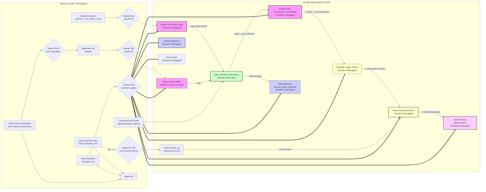

# Projet : Pipeline de Données GCP Java/Spark (Simulation Migration Oracle/PLSQL vers GCP)

## 1. Introduction et Objectif

Ce projet met en œuvre un pipeline de données Big Data sur Google Cloud Platform (GCP) en utilisant Java et Apache Spark, complété par un système de notification événementiel via Cloud Functions, Eventarc et Pub/Sub. Son objectif principal est de simuler un cas d'usage pertinent pour l'optimisation de la maintenance dans le secteur aéronautique : la **mise à jour des heures de vol totales des aéronefs** en fonction des vols récents. Ce projet a été inspiré par une offre de mission pour un rôle de Data Engineer / Tech Lead et s'inscrit dans le contexte d'une **simulation de migration d'une application et de ses données depuis une base Oracle historique contenant potentiellement de la logique métier en PL/SQL.**

Il sert également de démonstration pratique des compétences en traitement de données distribuées (Spark), gestion d'infrastructure cloud (GCP, Terraform), développement serverless (Cloud Functions), architecture événementielle (Eventarc, Pub/Sub) et bonnes pratiques de développement (Java, Python, Maven, Git, Tests Unitaires).

Enfin, ce projet est conçu comme une **simulation de migration** vers le cloud, représentant l'état cible d'une architecture de données moderne sur GCP, **en remplacement d'un système hérité basé sur Oracle/PLSQL (hypothétique).**

## 2. Architecture

Le pipeline suit le flux de données et d'événements suivant :

1.  **Données Sources :** Deux fichiers CSV (ex: CSV **représentant des extraits de tables Oracle** comme `AIRCRAFTS` et `FLIGHT_LOGS`) sont utilisés (`aircraft_initial_state.csv`, `recent_flights.csv`).
2.  **Ingestion (Simulation) :** Les données sources sont uploadées manuellement (via `gsutil`) vers un bucket **Google Cloud Storage (GCS)** servant de zone de stockage brute ("Raw Zone").
3.  **Traitement Batch :** Une application **Java/Spark** (packagée en JAR "mince") est exécutée sur **Dataproc Serverless**.
    * L'application lit les deux fichiers CSV depuis GCS en appliquant des schémas prédéfinis.
    * Elle effectue les transformations (jointure, agrégation) via l'API Spark SQL / DataFrame, **réimplémentant la logique métier potentiellement issue de procédures PL/SQL**.
    * Le JAR de l'application est stocké sur GCS.
4.  **Stockage des Résultats :** L'état mis à jour des avions est écrit dans une table **BigQuery** dédiée.
5.  **Marqueur de Fin :** À la fin du traitement réussi, le job Spark écrit un fichier marqueur vide (`_SUCCESS`) dans un dossier spécifique sur GCS (`processed/<nom_table>/`).
6.  **Déclenchement Événementiel :** Un trigger **Eventarc** détecte la création du fichier `_SUCCESS`.
7.  **Notification :** Le trigger Eventarc invoque une **Cloud Function (Python)**.
8.  **Publication :** La Cloud Function lit les détails de l'événement et publie un message de notification sur un topic **Pub/Sub**.
9.  **Infrastructure :** L'ensemble des ressources GCP (Bucket GCS, Dataset/Table BigQuery, Topic Pub/Sub, Compte de Service Fonction, Cloud Function, Trigger Eventarc, Permissions IAM) est défini et géré via **Terraform**.
10. **Configuration :** Les paramètres sont gérés via `terraform.tfvars` (infra) et arguments de ligne de commande (job Spark).



## 3. Stack Technique

* **Langages :** Java 11, Python 3.11, SQL (Spark SQL, BigQuery SQL), Bash
* **Framework Big Data :** Apache Spark 3.4.1 (Core & SQL)
* **Cloud :** Google Cloud Platform (GCP)
    * Stockage : Google Cloud Storage (GCS)
    * Traitement : Dataproc Serverless (Batches Spark)
    * Data Warehouse : BigQuery
    * Messagerie/Événementiel : Pub/Sub, Eventarc
    * Serverless : Cloud Functions (Gen2)
    * Identité/Accès : IAM
    * Build/Déploiement : Cloud Build (implicite via CF), Artifact Registry (potentiellement pour CF)
* **Infrastructure as Code :** Terraform (`1.13.3`, Provider Google `>= 5.20.0`)
* **Build Tool :** Apache Maven
* **Tests :** JUnit 5 (Jupiter), AssertJ
* **Librairies Clés :** google-cloud-pubsub (Python)
* **Version Control :** Git

## 4. Structure du Projet

Le projet est organisé comme suit :

* `/` : Racine (README.md, .gitignore, fichiers CSV exemples)
    * `aircraft_initial_state.csv` : Données initiales exemple.
    * `recent_flights.csv` : Vols récents exemple.
* `aero-data-processor/` : Module Maven pour l'application Java/Spark (`pom.xml`, `src/main/java`, `src/main/resources`, `src/test/java`).
    * `src/main/java/com/remi/aero/AeroDataProcessorApp.java`: Code principal du pipeline Spark.
    * `src/test/java/com/remi/aero/AeroDataProcessorAppTest.java`: Tests unitaires JUnit.
* `terraform/` : Code Terraform pour l'infrastructure GCP (`.tf`, `.tfvars`).
* `cloud_function_src/` : Code source Python pour la Cloud Function (`main.py`, `requirements.txt`).

## 5. Prérequis

Pour exécuter ce projet, vous aurez besoin de :

* Git
* JDK 11
* Apache Maven
* Google Cloud SDK (`gcloud`) configuré et authentifié (`gcloud auth application-default login`)
* Terraform CLI (version compatible avec le provider Google >= 5.20.0)
* Compte Google Cloud Platform avec un projet créé et les API nécessaires activées (Compute Engine, Dataproc, Cloud Storage, BigQuery, IAM, **Cloud Functions, Cloud Build, Cloud Run Admin, Eventarc, Pub/Sub**).

## 6. Configuration

1.  **Terraform :**
    * Créez un fichier `terraform/terraform.tfvars` (ignoré par Git).
    * Définissez les variables suivantes dedans :
        ```hcl
        # terraform/terraform.tfvars
        project_id             = "<VOTRE_PROJECT_ID_GCP>"
        region                 = "<VOTRE_REGION_GCP>" # ex: "europe-west1"
        gcs_bucket_name_suffix = "<SUFFIXE_UNIQUE_POUR_BUCKET>" # ex: "aero-data-proc-rem"
        bq_dataset_name        = "<NOM_DATASET_BIGQUERY>" # ex: "aero_data_proc_results"
        pubsub_topic_id        = "<ID_DU_TOPIC_PUBSUB>" # ex: "aero-pipeline-notifications"
        ```

2.  **Application Spark (Arguments de Ligne de Commande) :**
    * L'application `AeroDataProcessorApp` attend **6** arguments lors de sa soumission via `gcloud`.
    * Ordre des arguments (passés après `--`) :
        1.  `aircraft_input_path`: Chemin GCS `aircraft_initial_state.csv`.
        2.  `flights_input_path`: Chemin GCS `recent_flights.csv`.
        3.  `gcs_temp_bucket`: Nom bucket GCS temporaire pour BQ.
        4.  `bq_project_id`: ID projet GCP.
        5.  `bq_dataset_name`: Nom dataset BigQuery cible.
        6.  `bq_output_table_name`: Nom table BigQuery cible (ex: `aircraft_status_updated`).

## 7. Comment Lancer le Pipeline (Étape par Étape)

*Toutes les commandes sont à lancer depuis la racine du projet (`gcp-java-spark-migration/`), sauf indication contraire.*

1.  **Cloner le Dépôt :**
    ```bash
    git clone <URL_DU_DEPOT>
    cd gcp-java-spark-migration
    ```
2.  **Configurer Terraform :**
    * Créez et remplissez `terraform/terraform.tfvars`.
3.  **Déployer l'Infrastructure GCP :**
    ```bash
    cd terraform
    terraform init -upgrade # Pour prendre en compte version provider & data source
    terraform apply # Confirmer avec 'yes'. Crée toutes les ressources GCP.
    cd ..
    ```
    *Notez le nom exact du bucket GCS créé.*
4.  **Uploader les Données Sources sur GCS :**
    ```bash
    # Remplacer <NOM_BUCKET_CREE>
    gsutil cp aircraft_initial_state.csv gs://<NOM_BUCKET_CREE>/raw_data/
    gsutil cp recent_flights.csv gs://<NOM_BUCKET_CREE>/raw_data/
    ```
5.  **Compiler l'Application Spark JAR :**
    ```bash
    cd aero-data-processor
    # Assurez-vous que <scope>provided</scope> EST présent pour les dépendances Spark/BQ/GCS dans pom.xml
    mvn clean package
    cd ..
    ```
6.  **Uploader le JAR Applicatif sur GCS :**
    ```bash
    # Remplacer <NOM_BUCKET_CREE>
    gsutil cp aero-data-processor/target/aero-data-processor-1.0-SNAPSHOT.jar gs://<NOM_BUCKET_CREE>/jars/
    ```
7.  **Soumettre le Job Dataproc Serverless (6 arguments) :**
    ```bash
    # Remplacer TOUS les placeholders <...>
    # Utiliser l'approche spark.jars.packages si elle a fonctionné, sinon adapter
    gcloud dataproc batches submit spark \
        --region=<TA_REGION> \
        --jars=gs://<NOM_BUCKET_CREE>/jars/aero-data-processor-1.0-SNAPSHOT.jar \
        --class=com.remi.aero.AeroDataProcessorApp \
        # --properties=... (Ex: spark.jars.packages ou config CPU si nécessaire) \
        -- \
        gs://<NOM_BUCKET_CREE>/raw_data/aircraft_initial_state.csv \
        gs://<NOM_BUCKET_CREE>/raw_data/recent_flights.csv \
        <NOM_BUCKET_CREE> \
        <TON_PROJECT_ID> \
        <NOM_DATASET_BIGQUERY> \
        aircraft_status_updated
    ```
8.  **Vérifier les Résultats et la Notification :**
    * Suivez le statut du job Spark (`Succeeded`) dans Dataproc > Batches.
    * Consultez les logs du driver Spark (pour voir le log d'écriture du `_SUCCESS`).
    * Vérifiez le contenu de la table `aircraft_status_updated` dans BigQuery.
    * Vérifiez la création du fichier `_SUCCESS` dans GCS (`gs://<NOM_BUCKET_CREE>/processed/aircraft_status_updated/_SUCCESS`).
    * Consultez les logs de la Cloud Function (`aero-gcs-notify-function`).
    * Vérifiez la réception du message de notification dans le Topic Pub/Sub (via une souscription Pull).

## 8. Aspect "Simulation de Migration" (Oracle/PLSQL vers GCP/Spark)

Ce projet illustre plusieurs facettes d'une migration depuis un système Oracle/PLSQL vers GCP :

* **Infrastructure Cible via IaC :** Utilisation de Terraform pour créer l'environnement GCP moderne et scalable (GCS, BQ, Pub/Sub, CF, Eventarc).
* **Transfert de Données (Simulé) :** L'upload des fichiers CSV (représentant des extraits de tables Oracle) vers GCS simule la phase 'Extract & Load'.
* **Migration de la Logique (Simulée) :** Le code Spark/Java réimplémente la logique métier (calcul heures de vol) qui aurait pu résider dans des procédures PL/SQL, la déplaçant vers une plateforme de traitement distribuée. Le système de notification découplé modernise également la communication post-traitement.

## 9. Améliorations Possibles

* Utiliser des données aéronautiques publiques plus riches et variées.
* Implémenter une logique métier Spark plus complexe.
* **Tests Unitaires :** Étendre la couverture (tester la lecture/écriture avec mocks, la fonction Python).
* **Gestion d'Erreurs :** Raffiner dans Spark et dans la Cloud Function, ajouter des mécanismes de rejeu ou de "dead-letter queue" pour Pub/Sub/CF.
* **Parsing d'Arguments Spark :** Utiliser une librairie dédiée (JCommander, picocli).
* **Orchestration Complète :** Remplacer le déclenchement Eventarc/CF par Cloud Composer (Airflow) pour une gestion de workflow plus robuste.
* **Monitoring & Alerting :** Intégrer Cloud Monitoring sur les métriques Dataproc, CF, Pub/Sub, GCS, BQ.
* **Permissions IAM :** Utiliser des comptes de service dédiés également pour le job Dataproc, affiner les rôles au minimum nécessaire.
* **CI/CD :** Automatiser les tests, le build et le déploiement Terraform/Cloud Function/Spark JAR via Cloud Build ou GitHub Actions.
